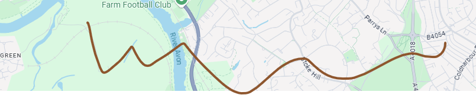

We hold a number of regular board game meet ups. If you would like to come along to any of them, please let us know via Discord or email!

Venue            |  Frequency              |  Time          |  Price
---------------  |---------------------    |----------------|--------
YHA              |  Mondays. Weekly.        |  17:30-22:00   |  Free
Chance & Counters | Tuesdays. Weekly.       |  18:00-23:00   | £1/hour
Kiln Workshop    |  1st Sunday. Monthly.    |  18:15-23:00   | Free
Advanced Retreat  | 2nd Saturday. Monthly. |  18:30-00:30    |£3
The Old Duke     |  3rd Saturday. Monthly. | 18:00-01:00     | Free
Replay            | 4th Saturday. Monthly.   |  18:00-23:00   | £1/hour
Excelsior Games | 4th Sunday. Monthly.       | 11:00-17:00   | Free

### __Advanced Retreat__

  image
  <iframe src="https://www.google.com/maps/embed?pb=!1m18!1m12!1m3!1d2485.7935628891273!2d-2.589706765091819!3d51.461946564189!2m3!1f0!2f0!3f0!3m2!1i1024!2i768!4f13.1!3m3!1m2!1s0x48718e73a2cb7943%3A0x97d9eaa777fcdc2a!2sAdvanced%20Retreat%20Members%20Club!5e0!3m2!1sen!2suk!4v1738507330699!5m2!1sen!2suk" width="400" height="300" style="border:0;" allowfullscreen="" loading="lazy" referrerpolicy="no-referrer-when-downgrade"></iframe>

Where: 18a Backfields Ln, St Paul's, BS2 8QW

Advanced Retreat is a retro arcade club, hidden behind Stokes Croft! We use the space for a monthly board game evening, but a full membership can be purchased with AR in order to use their arcade machines on their club nights.

### __Excelsior Games__

  image
  <iframe src="https://www.google.com/maps/embed?pb=!1m18!1m12!1m3!1d4180.9412363184165!2d-2.5932829724131308!3d51.458109932464396!2m3!1f0!2f0!3f0!3m2!1i1024!2i768!4f13.1!3m3!1m2!1s0x48718e716d01d22f%3A0xeab38084c783dd7a!2sExcelsior%20Comics%20Ltd!5e0!3m2!1sen!2suk!4v1738507536047!5m2!1sen!2suk" width="400" height="300" style="border:0;" allowfullscreen="" loading="lazy" referrerpolicy="no-referrer-when-downgrade"></iframe>

Where: 51-53 Merchant St, Broadmead, BS1 3EE

Daytime gaming, ideal for a lazy Sunday afternoon! We also run a games design table during this event, for anyone to come along and work on your own board games with like-minded people!

### __Kiln Workshop__

  image
  <iframe src="https://www.google.com/maps/embed?pb=!1m18!1m12!1m3!1d2485.257440040249!2d-2.5941152344580214!3d51.47178869976014!2m3!1f0!2f0!3f0!3m2!1i1024!2i768!4f13.1!3m3!1m2!1s0x48718e094906bdeb%3A0xa731fe12077321d3!2sKiln%20Workshop!5e0!3m2!1sen!2suk!4v1738507570951!5m2!1sen!2suk" width="400" height="300" style="border:0;" allowfullscreen="" loading="lazy" referrerpolicy="no-referrer-when-downgrade"></iframe>

Where: Kiln Workshop. 63 North Rd, Bishopston, BS6 5AD

The owners of the Kiln Studio let us use their pottery studio once a month. It's a really nice cosy little space, with large tables and great lighting! Good for larger euros, and table hogs!

### __The Old Duke__

  image
  <iframe src="https://www.google.com/maps/embed?pb=!1m18!1m12!1m3!1d2486.3508239506004!2d-2.5952421315019274!3d51.45171494607229!2m3!1f0!2f0!3f0!3m2!1i1024!2i768!4f13.1!3m3!1m2!1s0x48718e78fa6c82df%3A0x3ebd917be8c31326!2sThe%20Old%20Duke!5e0!3m2!1sen!2suk!4v1738507590582!5m2!1sen!2suk" width="400" height="300" style="border:0;" allowfullscreen="" loading="lazy" referrerpolicy="no-referrer-when-downgrade"></iframe>

Where: 45 King St, BS1 4ER

A really fun venue above the Jazz bar on King Street! We can stay late, and play loud! Perfect for negotiation and social deduction games!

### __Replay__

  image
  <iframe src="https://www.google.com/maps/embed?pb=!1m18!1m12!1m3!1d5911.537230877614!2d-2.5973041727780974!3d51.46742346539875!2m3!1f0!2f0!3f0!3m2!1i1024!2i768!4f13.1!3m3!1m2!1s0x48718e0b9ea095cf%3A0x8a40fd52ead5f683!2sReplay%20Bristol%20Board%20Game%20Cafe!5e0!3m2!1sen!2suk!4v1738507615351!5m2!1sen!2suk" width="400" height="300" style="border:0;" allowfullscreen="" loading="lazy" referrerpolicy="no-referrer-when-downgrade"></iframe>

Where: 196 Cheltenham Rd, Montpelier, BS6 5RB

Replay give WCL members cheaper gaming one Saturday a month! Once of the nicest gaming cafés in Bristol. Booking is required for this venue, so see the Discord for more information.

### __YHA__

  image
  <iframe src="https://www.google.com/maps/embed?pb=!1m18!1m12!1m3!1d2486.458571061569!2d-2.59868772832214!3d51.449736482182196!2m3!1f0!2f0!3f0!3m2!1i1024!2i768!4f13.1!3m3!1m2!1s0x48718dd6745caad7%3A0xfa062c9e2c242995!2sYHA%20Bristol!5e0!3m2!1sen!2suk!4v1738507636326!5m2!1sen!2suk" width="400" height="300" style="border:0;" allowfullscreen="" loading="lazy" referrerpolicy="no-referrer-when-downgrade"></iframe>

Where: Youth Hostels Association. 14 Narrow Quay, BS1 4QA

We head to the Youth Hostel Association by the harbourside every Monday evening.
It's nice and quiet, and we generally have the mezzanine to ourselves!
Perfect for smaller board games and card games that don't need too much table space.

### __BGA__

image

Where: [BGA](https://boardgamearena.com/welcome)

We also host regularly Board Game Arena evenings online.

### __SAMPLE ONE__

We also host regularly Board Game Arena evenings online.

Where: [196 Cheltenham Rd, Montpelier, BS6 5RB](https://maps.app.goo.gl/cJKPHamb9EqFut2q8)

<iframe src="https://www.google.com/maps/embed?pb=!1m18!1m12!1m3!1d19876.033125657275!2d-2.6573181152343897!3d51.485615484021054!2m3!1f0!2f0!3f0!3m2!1i1024!2i768!4f13.1!3m3!1m2!1s0x48718d87f3c2c861%3A0x3ea2cf3e3a2630f7!2sBristol%20City%20Council%20-%20Adult%20Learning!5e0!3m2!1sen!2suk!4v1738425738084!5m2!1sen!2suk" width="600" height="450" style="border:0;" allowfullscreen="" loading="lazy" referrerpolicy="no-referrer-when-downgrade"></iframe>
