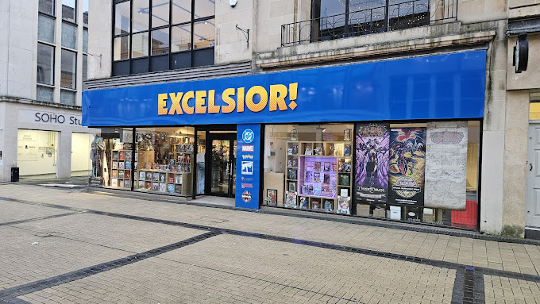
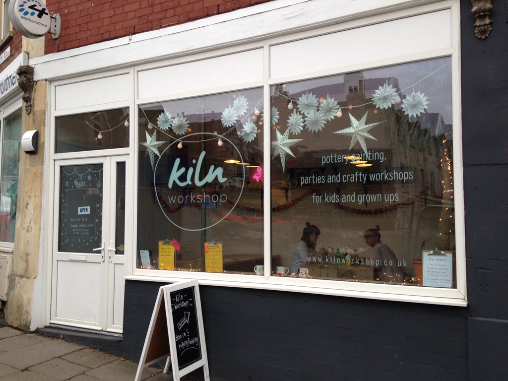

We hold a number of regular board game meet ups. If you would like to come along to any of them, please let us know via Discord or email!

Venue            |  Frequency              |  Time          |  Price
---------------  |---------------------    |----------------|--------
[YHA](#yha)              |  Mondays. Weekly.        |  17:30-22:00   |  Free
[Chance and Counters](#chance-and-counters) | Tuesdays. Weekly.       |  18:00-23:00   | £1/hour
[Kiln Workshop](#kiln-workshop)    |  1st Sunday. Monthly.    |  18:15-23:00   | Free
[The Old Duke](#the-old-duke)     |  3rd Saturday. Monthly. | 18:00-01:00     | Free
[Replay](#replay)            | 4th Saturday. Monthly.   |  18:00-23:00   | £1/hour
[Excelsior Games](#excelsior-games) | 4th Sunday. Monthly.       | 11:00-17:00   | Free

### __Chance and Counters__

  image

  The board games café, Chance & Counters host a weekly cheap games evening designed to facilitate meeting new people! A few of us usually go along to play something from the huge collection of games that C&C have. There are two Chance & Counters cafés in Bristol, and this one is on Gloucester Road!

  **Location:** 79A Gloucester Road, BS7 8AS
  <iframe src="https://www.google.com/maps/embed?pb=!1m18!1m12!1m3!1d2485.276732747502!2d-2.592363866792998!3d51.47143454786868!2m3!1f0!2f0!3f0!3m2!1i1024!2i768!4f13.1!3m3!1m2!1s0x48718f6b88301d8b%3A0xcfa213285d0cd61d!2sChance%20%26%20Counters!5e0!3m2!1sen!2suk!4v1738693280878!5m2!1sen!2suk" width="400" height="300" style="border:0;" allowfullscreen="" loading="lazy" referrerpolicy="no-referrer-when-downgrade"></iframe>

### __Excelsior Games__

Daytime gaming, ideal for a lazy Sunday afternoon! We also run a games design table during this event, for anyone to come along and work on your own board games with like-minded people!

**Location:** 51-53 Merchant St, Broadmead, BS1 3EE
<iframe src="https://www.google.com/maps/embed?pb=!1m18!1m12!1m3!1d4180.9412363184165!2d-2.5932829724131308!3d51.458109932464396!2m3!1f0!2f0!3f0!3m2!1i1024!2i768!4f13.1!3m3!1m2!1s0x48718e716d01d22f%3A0xeab38084c783dd7a!2sExcelsior%20Comics%20Ltd!5e0!3m2!1sen!2suk!4v1738507536047!5m2!1sen!2suk" width="100%" height="300" style="border:0;" allowfullscreen="" loading="lazy" referrerpolicy="no-referrer-when-downgrade"></iframe>

### __Kiln Workshop__

The owners of the Kiln Studio let us use their pottery studio once a month. It's a really nice cosy little space, with large tables and great lighting! Good for larger euros, and table hogs!

**Location:** Kiln Workshop. 63 North Rd, Bishopston, BS6 5AD
  <iframe src="https://www.google.com/maps/embed?pb=!1m18!1m12!1m3!1d2485.257440040249!2d-2.5941152344580214!3d51.47178869976014!2m3!1f0!2f0!3f0!3m2!1i1024!2i768!4f13.1!3m3!1m2!1s0x48718e094906bdeb%3A0xa731fe12077321d3!2sKiln%20Workshop!5e0!3m2!1sen!2suk!4v1738507570951!5m2!1sen!2suk" width="100%" height="300" style="border:0;" allowfullscreen="" loading="lazy" referrerpolicy="no-referrer-when-downgrade"></iframe>

### __The Old Duke__

  image

 A really fun venue above the Jazz bar on King Street! We can stay late, and play loud! Perfect for negotiation and social deduction games!

 **Location:** 45 King St, BS1 4ER
 <iframe src="https://www.google.com/maps/embed?pb=!1m18!1m12!1m3!1d2486.3508239506004!2d-2.5952421315019274!3d51.45171494607229!2m3!1f0!2f0!3f0!3m2!1i1024!2i768!4f13.1!3m3!1m2!1s0x48718e78fa6c82df%3A0x3ebd917be8c31326!2sThe%20Old%20Duke!5e0!3m2!1sen!2suk!4v1738507590582!5m2!1sen!2suk" width="100%" height="300" style="border:0;" allowfullscreen="" loading="lazy" referrerpolicy="no-referrer-when-downgrade"></iframe>

### __Replay__

  image

Replay give WCL members cheaper gaming one Saturday a month! Once of the nicest gaming cafés in Bristol. Booking is required for this venue, so see the Discord for more information.

**Location:** 196 Cheltenham Rd, Montpelier, BS6 5RB
  <iframe src="https://www.google.com/maps/embed?pb=!1m18!1m12!1m3!1d5911.537230877614!2d-2.5973041727780974!3d51.46742346539875!2m3!1f0!2f0!3f0!3m2!1i1024!2i768!4f13.1!3m3!1m2!1s0x48718e0b9ea095cf%3A0x8a40fd52ead5f683!2sReplay%20Bristol%20Board%20Game%20Cafe!5e0!3m2!1sen!2suk!4v1738507615351!5m2!1sen!2suk" width="100%" height="300" style="border:0;" allowfullscreen="" loading="lazy" referrerpolicy="no-referrer-when-downgrade"></iframe>

### __YHA__

  image

We head to the Youth Hostel Association by the harbourside every Monday evening.
It's nice and quiet, and we generally have the mezzanine to ourselves!
Perfect for smaller board games and card games that don't need too much table space.

**Location:** Youth Hostels Association. 14 Narrow Quay, BS1 4QA
  <iframe src="https://www.google.com/maps/embed?pb=!1m18!1m12!1m3!1d2486.458571061569!2d-2.59868772832214!3d51.449736482182196!2m3!1f0!2f0!3f0!3m2!1i1024!2i768!4f13.1!3m3!1m2!1s0x48718dd6745caad7%3A0xfa062c9e2c242995!2sYHA%20Bristol!5e0!3m2!1sen!2suk!4v1738507636326!5m2!1sen!2suk" width="100%" height="300" style="border:0;" allowfullscreen="" loading="lazy" referrerpolicy="no-referrer-when-downgrade"></iframe>

### __Board Game Arena (BGA)__

We also host regularly Board Game Arena evenings online.

**Location:** [BGA](https://boardgamearena.com/welcome)
